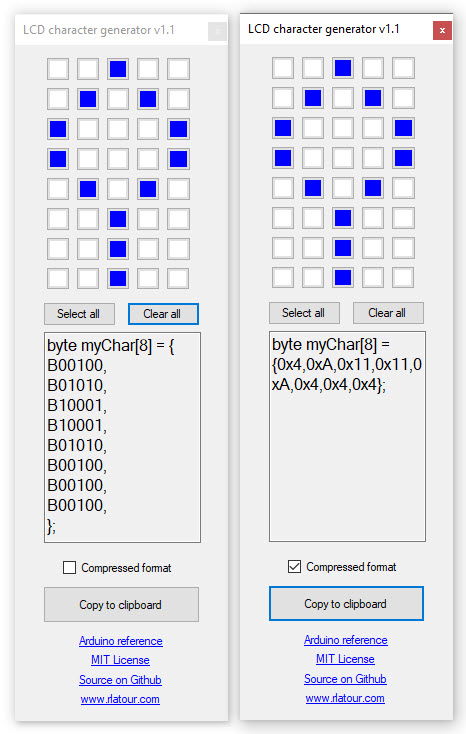

# LCD Character Generator

LCD Character Generator is a tiny program for Window which lets you graphically build a customized character for a liquid crystal display to be used in your IOT (Arduino, Raspberry Pi, etc.) project.

**Here's a couple screen shots:**

The one on the left showing the character being built using a binary representation, the one on the right using hexadecimal instead.

 
For a quick video including some usage tips, please click [here](https://www.youtube.com/watch?v=_Rmqm2mtdlY)

## Download

You are welcome to download and use it for free on as many computers as you would like.  

To download a copy of the program now, please click [here](https://github.com/roblatour/LCDCharGenerator/releases/download/v1.0.0.0/LCDCharGenerator.exe).  

Of note, the executable file is very small and doesn't need an installer.

You can store it anywhere on your Windows machine and run it from there.

* * *
 ## Supporting LCD Character Generator

 To help support LCD Character Generator, or to just say thanks, you're welcome to 'buy me a coffee'  

* * *
Copyright © 2020 Rob Latour
* * *   
